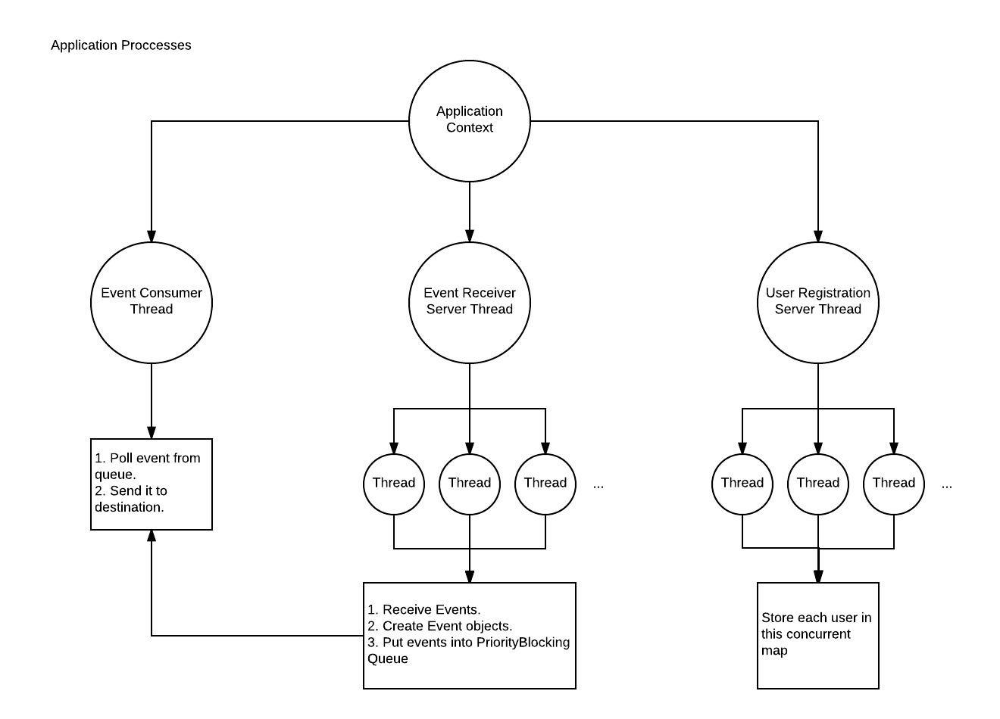

# Back-end Developer Challenge: Follower Maze

In this application, i tried to handle an unlimited event stream by creating a server. Server software flow charts and it is overal design images are attached to this readme file. So i will explain the architecture of the solution with these images.

## Application Architecture and Processes
When we have a look to the image `Application Processes` we can see there are three threads runnning with the initialization. One thread for user registration, one for event receiving and the last one for event consuming. Lets explain what they are doing exactly.

### User Registration Server
In the application, i am calling classes as server if they are listening a socket. So with this server we are listening the registration port which is default 9099. This thread continuously listens connections and accept if there is. Whenever a new socket created, this server assigns it to a user registration handler. Server creates this handler threads from the connection pool.
Server repeats these steps until the application shutdown. 

#### User Registration Handler
This is a thread for creating the user object with user id and accepted socket writer also adding this user to the user map. This is a thread because we have to release the socket process as soon as possible we can. For the sake of any other socket connections. In here handler reads the input stream of the socket until there is nothing in it. For the each line, it creates a User object and sets the socket's output stream writer into user. This is because, maybe this user will be get notified later. So the paylod of the notification will be send over this output stream writer. Also users are containing the follower lists. After user creation this user is stored in a concurrent hash map with the key as an id of user.

### Event Receiver Server
With this server we are listening the registration port which is default 9090. This thread continuously listens connections and accept if there is. Whenever a new socket created, this server assigns it to a event receiver handler. By the way, according to my analysis there is only one event source is creating in our test scenario. Anyway server creates this handler threads from the connection pool.
Server repeats these steps until the application shutdown.

#### Event Receiver Handler
This is a thread for creating the event object and adding it to the priority blocking queue. This is a thread because maybe later another event source wants to connect. In here handler reads the input stream of the socket, until there is nothing in it. For the each line, it creates an Event object. In this event object there are event type, from user id, to user id, payload itself and sequence. After event object creation, this event is added to the event queue. This is a priority blocking queue. Which means you can put elements in it with your comparasition logic. In our case Event class extends from  a Comporator so we can compare each event object with their sequence number. In our logic lower sequences are more close to the head of the queue. So please pay attention here because this logic provides us an ordered queue by changing the head of the queue when we try to put a new item in it.

### Event Consumer Manager
This is another thread of our application. This thread compares the head's sequence of the event queue with a counted sequence counter. When these sequences are equal this means that this event ready to ship. In order to do that it calls consume event function from the event consumer object of it. We did it because it requested like that in the instructions.

#### Envent Consumer
This is an object in consumer manager. It responsibles to deliver the event to the related destination according to it's type. Some of events are not suitable to deliver due to the rules. But still there could be some updates on the user like updating the follower queue.

I will not explain the restrictions of the events deliviring because it is already explained in the requirements document. But i will explain the challanges in this step.

When i start to test, i figured out that registered clients are getting new event requests from unregistered clients so in order to over come the i start to create this unregistered users as dummy users and add them to the user map. I have to do this because these dummy users followers needed to be notified in some cases. And those followers could be registered ones and they were expecting to get this notification. After dummy user implementation everything works fine.

## How It Works
In this section i will explain how you can test both with the JAR file that you provided and with the unit tests and integration tests.

### For Unit Testing
This project is created with gradle so it is enough to run `gradle test --info` for unit tests.

### For Integration Testing
I also added some integration tests. Which means real servers and a tcp client are created then start to send events. I added another gradle task in my project for testing integration. To do that just run `gradle integrationTest --info`

### Test With Provided JAR
To test with the jar that you provided, first you have to run my application. I suggest to run with `./run.sh` file. Because you can set some enviromental variables before you run the application with shell script. (Please have a look configuration section for details.) This will run the application in development mode. 

If you want to build a JAR file of the application and running it please run `./run.sh --prod` command. This will run the all tests and build the application then create a JAR file under `/build/libs/soundcloud-all-1.0.jar`. Also it runs the application immediately. (Note a sample jar file is also added to the root of the project so maybe you want to run this jar file directly and starts the app. This is just for any case failed build.)

And after you see *Servers are up and running.* message you can run `./followermaze.sh` and wait until the results are shown.

*Please note that: You can run the application with default configs by running `gradle run` command too on cli.*

## Configuration
You can run the application with the enviromental variables below:
* **CONCURRENCY_LEVEL:** This represents number of threads in your thread pool. If you set this one different from `0` this means your thread pool will have this number of threads. If you leave it as 0 this means that threads will be created auto accordingly the app needs. `Default is 0`.
* **LOG_LEVEL** You can set four log level. `all`, `debug`, `info`, `off`. `Default is off`.
* **REGISTRATION_SERVER_PORT** Port for registration server. `Default is 9099`.
* **EVENT_RECEIVER_SERVER_PORT** Port for event receiving server. `Default is 9090`.

## Logging
Applicaiton uses log4j logging library. You can activate or deactivate logging. When ever it is activated it dumps the log to the console and also it writes a new log file under `/logs` folder.

## Technology Used
* Java 8
* Gradle
* Junit